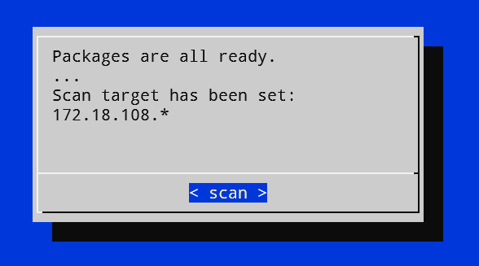
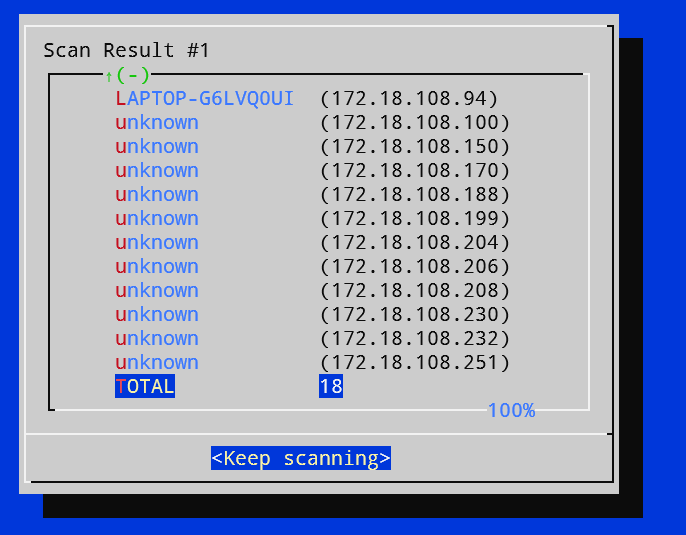

# Network Neighbors
- A shell script help to find hostname and IP address of Network Neighbors
- Support two package manager
  - homebrew
  - apt
- Use `system DNS` to convert scanned IP address to corresponding hostname
  - it will be `unknown` if IP doesn't have corresponding target.

## Features
- Automatically packages check
- Signal handler
- Temp file collection

## Usage
```
./netnei.sh apt/brew ["Reg match IP address"]
```
- Default, it will scan for "192.168.50.*"
  - which will match the hosts whose IP is 192.168.50.1, 192.168.50.2...
### Example
```
./netnei.sh apt "172.18.108.*"
```
- Sample output
  1. 
  2. 